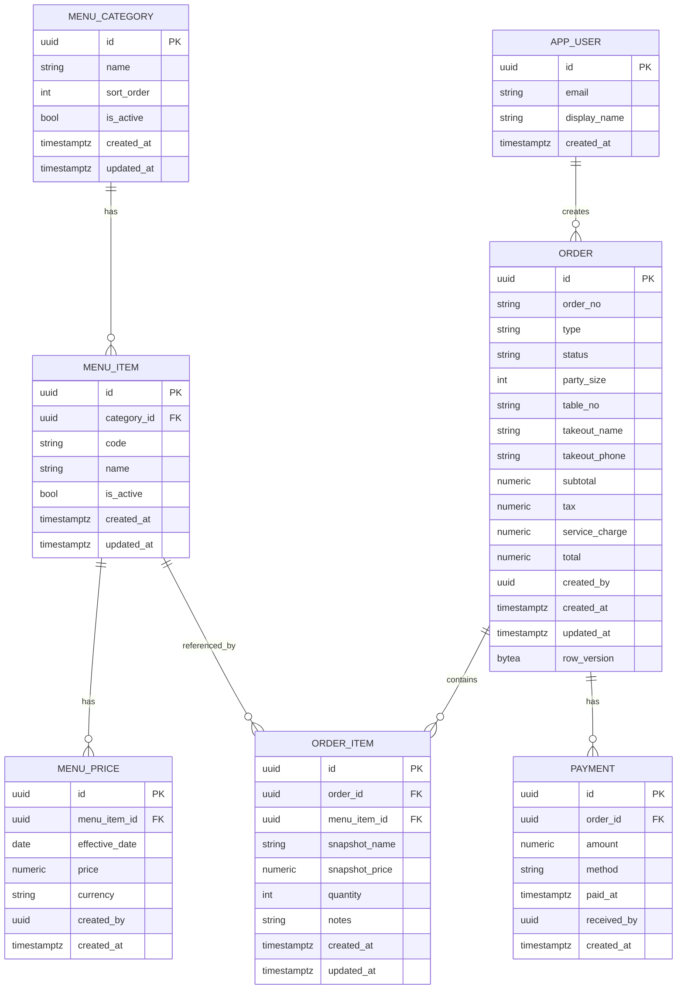

# Restaurant Order Manager — Instruction (instruction.md)

> A complete instruction for implementing a **.NET 9 Web API** backend for a simple restaurant order management system. This file is written as a developer-facing `instruction.md` you can copy & paste.

---

## 1. Overview

This repository will implement a compact, production-minded backend:

* **Platform**: .NET 9 Web API
* **Database**: PostgreSQL
* **ORM**: EF Core
* **Auth**: ASP.NET Core Identity + Google OIDC (OpenIdConnect)
* **Architecture**: 3-layer (Api / Core / Infrastructure)
* **Key features**: menu management with daily prices, order lifecycle (draft → submitted → confirmed → paid), role-based authorization (Manager, Server, Cashier), audit, docker-ready

The goal: hand this doc to an AI or a dev team and let them implement the system with minimal back-and-forth.

---

## 2. Goals & Non-Goals

**Goals**

* Web API for menu and order flows
* Daily price management (price snapshot per date)
* Order editing until checkout; checkout must be confirmed by cashier
* Role-based access: Manager, Server, Cashier
* Google OIDC external login + local Identity
* Audit logs and concurrency control

**Non-Goals**

* Integrated payment gateway (only record payments)
* Complex BI/reporting beyond basic daily/top-item reports

---

## 3. Project Structure (3-layer)


```
/src/RestaurantOrder.WebApi
  Api/           # Controllers, Authentication, Swagger
  Core/          # Domain: Entities, Enums, DTOs, Interfaces, UseCases
  Infrastructure/ # EF Core, Repositories, Identity, Postgres
  RestaurantOrder.WebApi.csproj
  Program.cs
  ...
```

所有程式碼皆放在同一個 RestaurantOrder.WebApi 專案下，依資料夾與命名空間區分三層架構。
依賴方向：`Api → Core → Infrastructure`。

---

## 4. ERD (Mermaid)



---

## 5. PostgreSQL DDL

Below are PostgreSQL scripts that create tables, indexes and constraints. They are intended to be used prior to running EF Core migrations if you prefer explicit DDL (or for reference). The EF Core model and migrations may generate similar DDL automatically.

> NOTE: This script uses `pgcrypto` for `gen_random_uuid()` — enable extension.

```sql
-- Enable extension for UUID generation
CREATE EXTENSION IF NOT EXISTS pgcrypto;

-- Menu Category
CREATE TABLE IF NOT EXISTS menu_category (
  id uuid PRIMARY KEY DEFAULT gen_random_uuid(),
  name text NOT NULL,
  sort_order int NOT NULL DEFAULT 0,
  is_active boolean NOT NULL DEFAULT true,
  created_at timestamptz NOT NULL DEFAULT now(),
  updated_at timestamptz NOT NULL DEFAULT now()
);
CREATE UNIQUE INDEX IF NOT EXISTS ux_menu_category_name ON menu_category (lower(name));

-- Menu Item
CREATE TABLE IF NOT EXISTS menu_item (
  id uuid PRIMARY KEY DEFAULT gen_random_uuid(),
  category_id uuid NOT NULL REFERENCES menu_category(id) ON DELETE RESTRICT,
  code text NOT NULL,
  name text NOT NULL,
  is_active boolean NOT NULL DEFAULT true,
  created_at timestamptz NOT NULL DEFAULT now(),
  updated_at timestamptz NOT NULL DEFAULT now()
);
CREATE UNIQUE INDEX IF NOT EXISTS ux_menu_item_code ON menu_item (lower(code));
CREATE INDEX IF NOT EXISTS ix_menu_item_category ON menu_item (category_id);

-- Menu Price (daily snapshot)
CREATE TABLE IF NOT EXISTS menu_price (
  id uuid PRIMARY KEY DEFAULT gen_random_uuid(),
  menu_item_id uuid NOT NULL REFERENCES menu_item(id) ON DELETE CASCADE,
  effective_date date NOT NULL,
  price numeric(12,2) NOT NULL,
  currency text NOT NULL DEFAULT 'TWD',
  created_by uuid NULL,
  created_at timestamptz NOT NULL DEFAULT now()
);
CREATE UNIQUE INDEX IF NOT EXISTS ux_menu_price_menuitem_date ON menu_price (menu_item_id, effective_date);
CREATE INDEX IF NOT EXISTS ix_menu_price_effective_date ON menu_price (effective_date);

-- Order
CREATE TABLE IF NOT EXISTS "order" (
  id uuid PRIMARY KEY DEFAULT gen_random_uuid(),
  order_no text NOT NULL UNIQUE,
  type text NOT NULL,
  status text NOT NULL,
  party_size int NULL,
  table_no text NULL,
  takeout_name text NULL,
  takeout_phone text NULL,
  subtotal numeric(12,2) NOT NULL DEFAULT 0,
  tax numeric(12,2) NOT NULL DEFAULT 0,
  service_charge numeric(12,2) NOT NULL DEFAULT 0,
  total numeric(12,2) NOT NULL DEFAULT 0,
  created_by uuid NULL,
  created_at timestamptz NOT NULL DEFAULT now(),
  updated_at timestamptz NOT NULL DEFAULT now(),
  row_version bytea
);
CREATE INDEX IF NOT EXISTS ix_order_status_createdat ON "order" (status, created_at);

-- Order Item
CREATE TABLE IF NOT EXISTS order_item (
  id uuid PRIMARY KEY DEFAULT gen_random_uuid(),
  order_id uuid NOT NULL REFERENCES "order"(id) ON DELETE CASCADE,
  menu_item_id uuid NULL REFERENCES menu_item(id) ON DELETE SET NULL,
  snapshot_name text NOT NULL,
  snapshot_price numeric(12,2) NOT NULL,
  quantity int NOT NULL DEFAULT 1,
  notes text NULL,
  created_at timestamptz NOT NULL DEFAULT now(),
  updated_at timestamptz NOT NULL DEFAULT now()
);
CREATE INDEX IF NOT EXISTS ix_orderitem_order ON order_item (order_id);

-- Payment
CREATE TABLE IF NOT EXISTS payment (
  id uuid PRIMARY KEY DEFAULT gen_random_uuid(),
  order_id uuid NOT NULL REFERENCES "order"(id) ON DELETE CASCADE,
  amount numeric(12,2) NOT NULL,
  method text NOT NULL,
  paid_at timestamptz NOT NULL DEFAULT now(),
  received_by uuid NULL,
  created_at timestamptz NOT NULL DEFAULT now()
);
CREATE INDEX IF NOT EXISTS ix_payment_paidat ON payment (paid_at);

-- Audit (simple audit log)
CREATE TABLE IF NOT EXISTS audit_log (
  id uuid PRIMARY KEY DEFAULT gen_random_uuid(),
  user_id uuid NULL,
  action text NOT NULL,
  entity text NOT NULL,
  entity_id uuid NULL,
  summary jsonb NULL,
  created_at timestamptz NOT NULL DEFAULT now()
);
CREATE INDEX IF NOT EXISTS ix_auditlog_user ON audit_log (user_id);

-- Minimal AppUser placeholder (if you prefer explicit table for non-Identity reference)
CREATE TABLE IF NOT EXISTS app_user (
  id uuid PRIMARY KEY DEFAULT gen_random_uuid(),
  email text NOT NULL UNIQUE,
  display_name text NULL,
  created_at timestamptz NOT NULL DEFAULT now()
);

-- Helpful views (optional)
CREATE VIEW IF NOT EXISTS view_daily_sales AS
SELECT
  date(p.paid_at) AS day,
  sum(p.amount) AS total_amount,
  count(distinct p.order_id) AS orders_count
FROM payment p
GROUP BY date(p.paid_at);

-- Triggers to update updated_at timestamp
CREATE OR REPLACE FUNCTION trigger_set_updated_at()
RETURNS TRIGGER AS $$
BEGIN
  NEW.updated_at = now();
  RETURN NEW;
END;
$$ LANGUAGE plpgsql;

CREATE TRIGGER trg_menu_item_updated_at
BEFORE UPDATE ON menu_item
FOR EACH ROW EXECUTE FUNCTION trigger_set_updated_at();

CREATE TRIGGER trg_menu_category_updated_at
BEFORE UPDATE ON menu_category
FOR EACH ROW EXECUTE FUNCTION trigger_set_updated_at();

CREATE TRIGGER trg_order_updated_at
BEFORE UPDATE ON "order"
FOR EACH ROW EXECUTE FUNCTION trigger_set_updated_at();

CREATE TRIGGER trg_order_item_updated_at
BEFORE UPDATE ON order_item
FOR EACH ROW EXECUTE FUNCTION trigger_set_updated_at();
```

---

## 6. Entities & Domain Rules (Concise)

* **MenuCategory**: id, name, sort\_order, is\_active
* **MenuItem**: id, category\_id, code (unique), name, is\_active
* **MenuPrice**: (menu\_item\_id, effective\_date) unique — this is the daily price snapshot
* **Order**: order\_no, type (DineIn/Takeout), status, party\_size, table\_no, totals, created\_by
* **OrderItem**: snapshot\_name & snapshot\_price must be stored on creation
* **Payment**: records payment event; when payment is recorded, Order -> Paid and order locked

**Business rules**

* If `Order.Type = DineIn` then `table_no` and `party_size` are required.
* Orders are editable only in `Draft` or `Submitted` states (before `Confirmed`/`Paid`).
* Only `Cashier` (or `Manager`) can `Confirm` and `Pay`.
* Back-office changes to `MenuItem` or `MenuPrice` must not mutate historical order data.
* Price lookup during order item add: choose `menu_price` where `menu_item_id = X and effective_date = today` — if not found, reject order item with 409/422.

---

## 7. API Contract (Highlights)

**Menu**

* `GET /api/menu/today` — returns active menu with today's prices (recommended for front-end simplicity)
* `GET /api/menu/items` — filter, search
* `POST /api/menu/items` — Manager
* `POST /api/menu/items/{id}/prices` — Manager (create price for a date)

**Orders**

* `POST /api/orders` — create draft order
* `PUT /api/orders/{id}` — update (draft/submitted only)
* `POST /api/orders/{id}/submit` — submit for confirmation
* `POST /api/orders/{id}/confirm` — cashier confirms
* `POST /api/orders/{id}/pay` — cashier records payment (body: amount, method)
* `POST /api/orders/{id}/cancel` — cancel (Manager or Cashier)

**Auth**

* `POST /api/auth/register`, `POST /api/auth/login`, `GET /api/auth/me`
* Google OIDC endpoints via external auth middleware (callback at `/signin-google`)

---

## 8. Identity & Authorization

* Use `AddIdentity<AppUser, IdentityRole>()` with `AddEntityFrameworkStores<AppDbContext>()`.
* Seed roles: `Manager`, `Server`, `Cashier`.
* Seed one Manager user during startup (or provide admin seeding script).
* Protect controllers with `[Authorize(Roles = "Manager")]` or policy-based authorization.
* Configure Google OIDC with `AddOpenIdConnect`/`AddGoogle` and map claims to roles or provision users on first login.

---

## 9. EF Core & DbContext

* `AppDbContext : IdentityDbContext<AppUser, IdentityRole, string>` or `Guid`-keyed Identity. Using `string` or `Guid` is up to you — Postgres DDL above assumes `uuid`.
* Configure composite unique index: `MenuPrice (MenuItemId, EffectiveDate)`.
* Configure concurrency token: `[Timestamp] public byte[] RowVersion { get; set; }` on `Order`.
* Use Npgsql EF Core provider: `UseNpgsql(Configuration.GetConnectionString("Default"))`.
* Consider automatic migrations on startup only in development.

---

## 10. Program.cs (skeleton) — .NET 9

```csharp
var builder = WebApplication.CreateBuilder(args);

// DB
builder.Services.AddDbContext<AppDbContext>(opts =>
  opts.UseNpgsql(builder.Configuration.GetConnectionString("Default")));

// Identity
builder.Services.AddIdentity<AppUser, IdentityRole>()
  .AddEntityFrameworkStores<AppDbContext>()
  .AddDefaultTokenProviders();

// Authentication: JWT + Google
builder.Services.AddAuthentication()
  .AddJwtBearer("Bearer", options => { /* configure */ })
  .AddGoogle(options => {
    options.ClientId = builder.Configuration["Auth:Google:ClientId"];
    options.ClientSecret = builder.Configuration["Auth:Google:ClientSecret"];
    options.CallbackPath = "/signin-google";
  });

builder.Services.AddAuthorization();

// Application services
builder.Services.AddScoped<IMenuService, MenuService>();
builder.Services.AddScoped<IOrderService, OrderService>();

builder.Services.AddControllers();
builder.Services.AddEndpointsApiExplorer();
builder.Services.AddSwaggerGen();

var app = builder.Build();
app.UseSwagger();
app.UseAuthentication();
app.UseAuthorization();
app.MapControllers();
app.MapHealthChecks("/health");
app.Run();
```

---

## 11. Concurrency & Consistency

* Use EF Core concurrency tokens on `Order` (RowVersion) to prevent lost updates.
* Use database unique constraints (MenuPrice) to prevent duplicate daily prices.
* Wrap multi-step operations (e.g., add item & recalc totals & save) in a transaction when needed.

---

## 12. Logging, Audit & Observability

* Use Serilog to log request/response and exceptions.
* Implement `AuditLog` entries for state changes (created\_by, action, entity, summary JSON).
* Health check endpoint and DB connectivity check.
* Optionally add OpenTelemetry traces for HTTP/DB calls.

---

## 13. Docker / Compose (quick)

```yaml
version: "3.9"
services:
  postgres:
    image: postgres:16
    environment:
      POSTGRES_USER: postgres
      POSTGRES_PASSWORD: postgres
      POSTGRES_DB: restaurant
    ports: ["5432:5432"]
    volumes:
      - pgdata:/var/lib/postgresql/data

  api:
    build: ./src/Restaurant.Api
    environment:
      ConnectionStrings__Default: "Host=postgres;Port=5432;Database=restaurant;Username=postgres;Password=postgres"
      ASPNETCORE_ENVIRONMENT: Development
    ports:
      - "8080:8080"
    depends_on:
      - postgres

volumes:
  pgdata: {}
```

---

## 14. Tests

* Unit: Domain logic (order state machine, totals calculation, price selection)
* Integration: Using Testcontainers PostgreSQL to run API flows (create menu, create order, submit, confirm, pay)
* Security: Ensure endpoints enforce role-based access (401/403 tests)

---

## 15. Seed Data (recommended)

* Seed roles and a Manager user on startup. Seed a few menu categories and menu items and today's `menu_price` records so front-end can quickly demo.

---

## 16. Milestones

1. M1: Project skeleton, DB context, EF Core setup, Swagger
2. M2: Menu CRUD + daily price endpoint + seed data
3. M3: Order flow (draft->submit->confirm->pay) + concurrency
4. M4: Identity + Google OIDC + role enforcement
5. M5: Audit, health checks, docker compose, basic reports
6. M6 (optional): SignalR for real-time updates, outbox pattern for events

---

## 17. Acceptance Criteria

* Full flow from create order to payment works via Swagger
* Daily price missing → attempts to price an order item cause clear 409/422
* Paid orders are immutable
* Roles: Manager/Server/Cashier enforced by the API

---

## 18. Next Steps for AI-driven Implementation

* Use this file as the single source-of-truth. Implement M1→M3 first. The EF Core model should reflect the DDL and mermaid ERD.
* Ensure the `GET /api/menu/today` returns menu tree with today's price to simplify front-end integration.

---

### Appendix: Quick sample SQL to seed roles & manager user (Postgres)

> Note: When using ASP.NET Core Identity with EF Core, prefer to seed identity data via the Identity APIs (UserManager/RoleManager) at app startup rather than raw SQL. The example below is illustrative only.

```sql
-- This is optional if you seed using Identity APIs. Keep for reference.
INSERT INTO app_user (id, email, display_name) VALUES (gen_random_uuid(), 'manager@example.com', 'Manager Demo');
```

---

*End of instruction.md*
